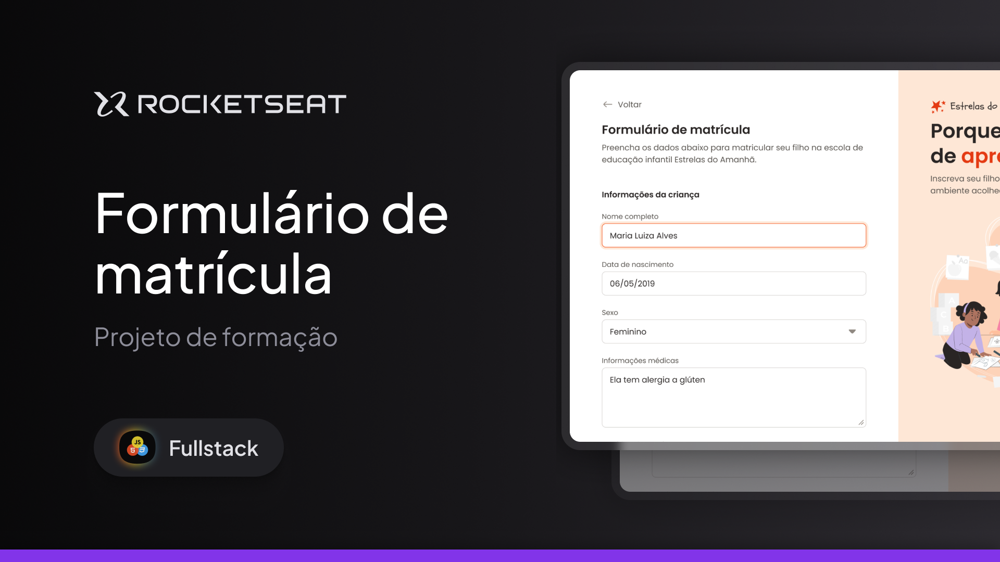

## 🖼️ Prévia do Projeto

---

## 💼 Sobre o Projeto

Este projeto foi desenvolvido como parte do desafio de formação da Rocketseat, com o objetivo de **praticar a construção de formulários HTML e aplicar fundamentos essenciais de CSS**.

A aplicação é **estática** (sem funcionalidades dinâmicas ou backend) e simula um **formulário de matrícula escolar** para a escola fictícia **"Estrelas do Amanhã"**.

O foco do desafio está no domínio de:

- Estrutura semântica com HTML5
- Boas práticas de formulários (input, textarea, select, radio, checkbox e upload de arquivos)
- Utilização de `fieldset` e `legend` para organização dos campos
- Estilização moderna e responsiva com CSS
- Experiência do usuário com feedbacks visuais e interações
- Uso de fontes externas (Google Fonts) e ícones SVG

---

## ✨ Funcionalidades Simuladas

Embora não tenha funcionalidades ativas, o formulário simula as seguintes interações:

- Cadastro de informações da criança (nome, nascimento, sexo, condição médica, certidão)
- Endereço residencial com preenchimento automático de alguns campos (fictício)
- Dados do responsável legal
- Escolha do turno escolar e esporte desejado
- Aceite de termos e condições
- Ações de salvar rascunho e enviar formulário

> 🔒 Nenhum dado é enviado de fato. O formulário é **apenas para fins de prática e prototipação**.

---

### 🛠️ Tecnologias Utilizadas

- **HTML5**
- **CSS3**

---

### 👨‍💻 Autor

Desenvolvido por Wigor.  
Projeto fictício com fins educacionais.
